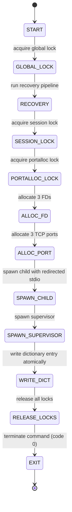
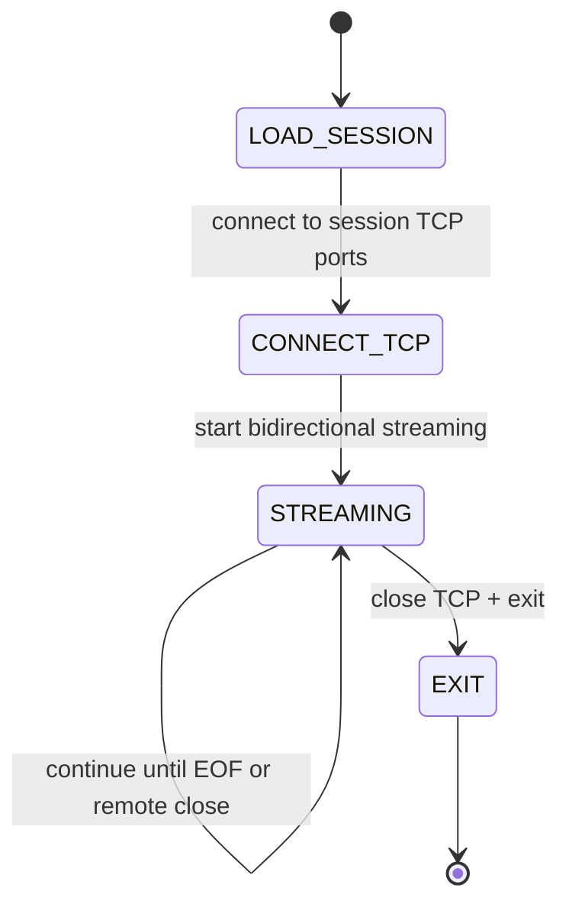
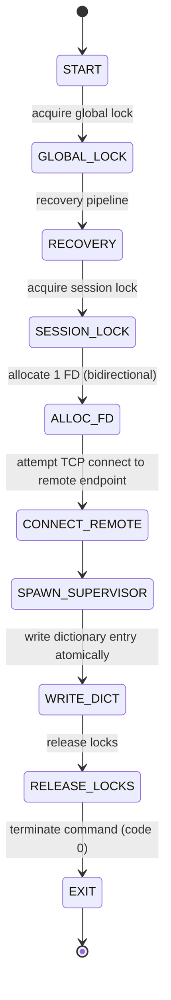
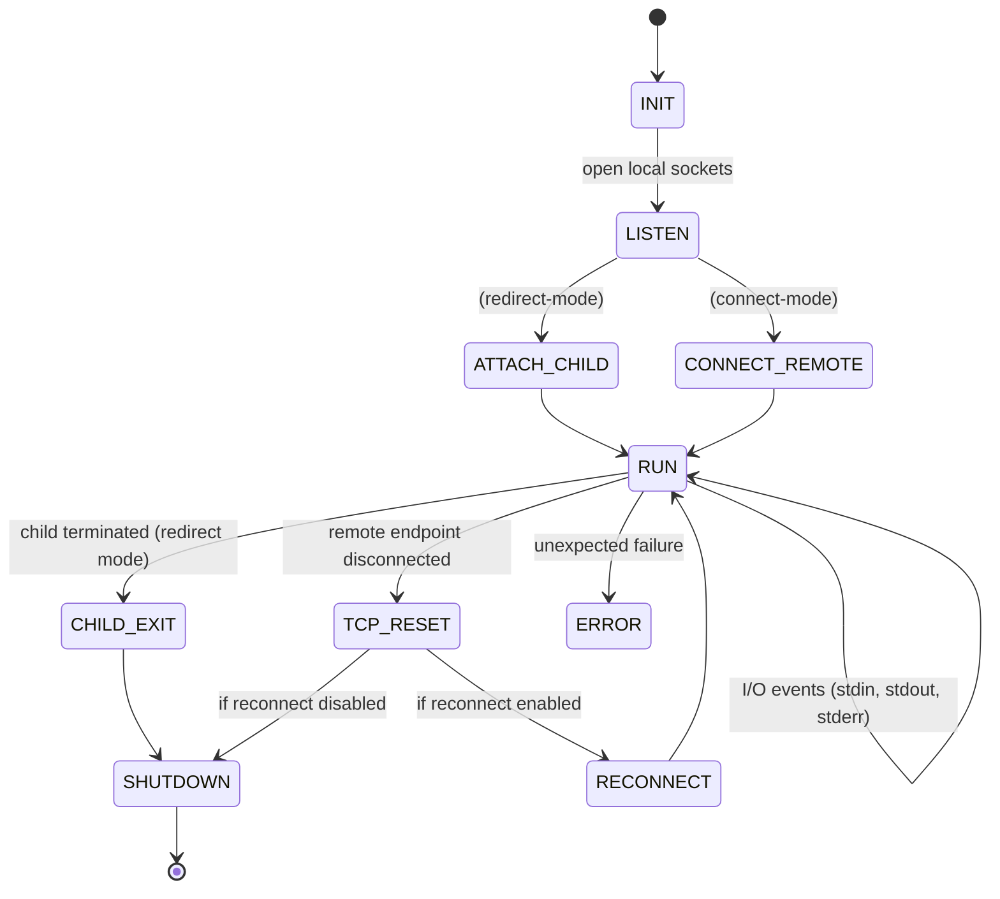
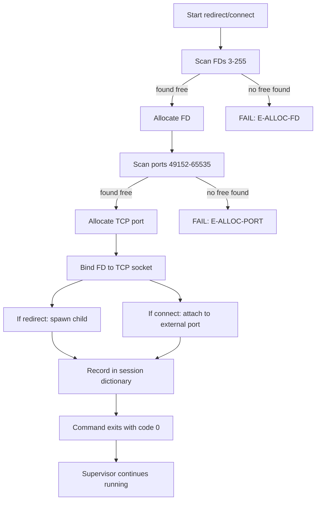
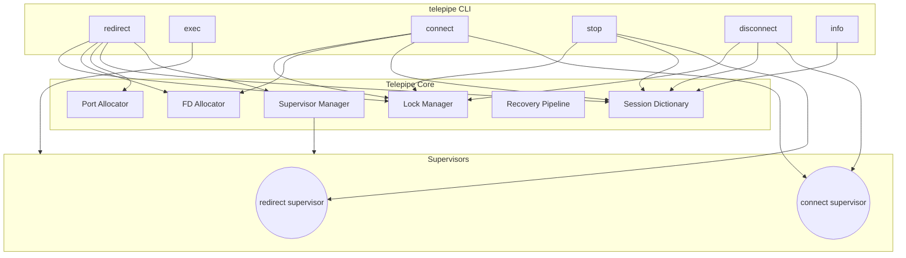
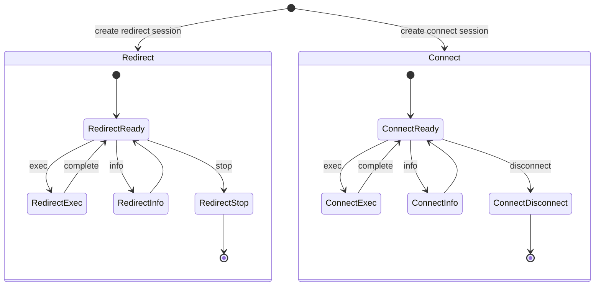

# Telepipe Architecture

High-level overview of how Telepipe works. Simple design, powerful capability.

---

## Overview

Telepipe is a **TCP tunnel supervisor** that manages connections between AI agents and real systems.

**Core concept:** One supervisor, N sessions, each session isolated.

```
         Telepipe Supervisor
                │
    ┌───────────┼───────────┐
    │           │           │
Session 1   Session 2   Session 3
(Chrome)      (DB)        (App)
```

---

## The Supervisor Model

One supervisor process manages all sessions:

- **Allocates resources** (ports, FDs)
- **Tracks session state**
- **Handles lifecycle** (start, exec, stop)
- **Cleans up** on termination

### Why a Supervisor?

- **One process to manage** - Simple, predictable
- **Resource isolation** - Each session independent
- **Clean lifecycle** - Automatic cleanup
- **State tracking** - Know what's running

---

## Session Types

Telepipe supports three connection patterns:

### 1. redirect Mode
**Spawn a process, redirect its stdio to TCP.**

```bash
telepipe redirect --id myapp -- node server.js
```

**Use for:**
- Node.js apps
- Python scripts
- Any process you want to control

**How it works:**
1. Telepipe allocates 3 TCP ports (stdin, stdout, stderr)
2. Spawns your process with redirected I/O
3. Supervisor manages the connection
4. You interact via `telepipe exec`

### 2. connect Mode
**Attach to an existing TCP service.**

```bash
telepipe connect --id db --port 5432
```

**Use for:**
- PostgreSQL, MySQL, Redis
- Any TCP service already running

**How it works:**
1. Telepipe connects to the existing service
2. Creates a session entry
3. You interact via `telepipe exec`

### 3. WebSocket Bridge Mode
**Use redirect + websocat for WebSocket protocols.**

```bash
WS_URL=$(curl -s http://127.0.0.1:9222/json/version | grep -o 'ws://[^"]*')
telepipe redirect --id chrome -- websocat --no-close --text "$WS_URL"
```

**Use for:**
- Chrome DevTools Protocol (CDP)
- WebSocket APIs

**Why websocat?**
Chrome CDP uses WebSockets (ws://), but Telepipe handles TCP. Websocat bridges the gap.

---

## Resource Management

### TCP Ports

- **Range:** 49152-65535 (IANA ephemeral)
- **3 ports per redirect session** (stdin, stdout, stderr)
- **1 port per connect session**
- **Automatic allocation** - No configuration needed
- **Automatic cleanup** - Released when session ends

### File Descriptors

- **Range:** 3-255
- **3 FDs per redirect session**
- **1 FD per connect session**
- **System limits enforced** - Error E-ALLOC-FD (21) if exhausted

### Process Supervision

- **Monitors child processes** (redirect mode)
- **Handles termination** - Graceful shutdown
- **Cleans up resources** - FDs, ports, sessions

---

## State Machine

Each session transitions through states:

```
Created → Ready → Busy → Ready → Terminated
            ↑________|
```

### States

| State | Description |
|-------|-------------|
| **Created** | Session initialized, resources allocated |
| **Ready** | Waiting for exec command |
| **Busy** | Exec in progress |
| **Terminated** | Session ended, resources released |

### Transitions

```
Created → Ready      (subprocess starts or connection established)
Ready → Busy         (exec received)
Busy → Ready         (exec completes)
Ready → Terminated   (stop/disconnect)
Busy → Terminated    (error)
```

---

## Security Model

**Localhost-only by default:**

- All connections bind to `127.0.0.1`
- No network exposure
- No remote connections accepted
- Process isolation

**No elevated privileges:**

- Runs as normal user
- No sudo, no setuid
- No system modifications

**Why this matters:**

- Safe for development environments
- Safe for CI/CD pipelines
- Safe for AI agents with file access

---

## One-at-a-Time Execution

Telepipe enforces **one exec per session at a time.**

**Why?**

- **Prevents response mixing** - Know which response belongs to which command
- **Deterministic ordering** - Commands execute in order
- **Simple state management** - No complex multiplexing

**If you need concurrent execution:**

```bash
# Use separate sessions
telepipe redirect --id worker1 -- node app.js
telepipe redirect --id worker2 -- node app.js

# Now you can exec in parallel
echo "cmd1" | telepipe exec --id worker1 &
echo "cmd2" | telepipe exec --id worker2 &
```

---

## Data Flow

### Redirect Mode

```
Your Input → TCP (stdin port) → Child Process stdin
Child Process stdout → TCP (stdout port) → Your Output
Child Process stderr → TCP (stderr port) → Your Errors
```

### Connect Mode

```
Your Input → TCP → External Service
External Service → TCP → Your Output
```

### WebSocket Bridge (CDP)

```
Your Input → TCP → websocat → WebSocket → Chrome
Chrome → WebSocket → websocat → TCP → Your Output
```

---

## Binary Transparency

Telepipe is **binary-blind**:

- No parsing of data
- No transformation of bytes
- No injection or stripping
- No protocol interpretation

**Your data passes through unchanged.**

This means:

- Works with any protocol (SQL, JSON, binary, etc.)
- No encoding issues
- No frame corruption
- Maximum compatibility

---

## Performance Characteristics

| Metric | Value |
|--------|-------|
| Session creation | <10ms |
| Exec overhead | <5ms |
| TCP round-trip | <1ms (localhost) |
| RAM per session | ~5MB |
| FDs per session | 3 (redirect) / 1 (connect) |
| Ports per session | 3 (redirect) / 1 (connect) |

**Throughput:** Limited by your application, not Telepipe. Direct TCP passthrough with no buffering overhead.

---

## Architecture Diagram

```
┌──────────────────────────────────────────────────────────┐
│                    Your AI Agent                         │
└─────────────────────────┬────────────────────────────────┘
                          │
                    TCP Connections
                          │
┌─────────────────────────┴────────────────────────────────┐
│                  Telepipe Supervisor                      │
│                                                           │
│  ┌─────────────┐  ┌─────────────┐  ┌─────────────┐       │
│  │  Session 1  │  │  Session 2  │  │  Session 3  │       │
│  │  (redirect) │  │  (connect)  │  │  (redirect) │       │
│  │             │  │             │  │             │       │
│  │  chrome     │  │  db         │  │  myapp      │       │
│  └──────┬──────┘  └──────┬──────┘  └──────┬──────┘       │
│         │                │                │              │
└─────────┼────────────────┼────────────────┼──────────────┘
          │                │                │
          ▼                ▼                ▼
    ┌──────────┐    ┌──────────┐    ┌──────────┐
    │ websocat │    │PostgreSQL│    │  Node.js │
    │    ↓     │    │          │    │  Server  │
    │  Chrome  │    │          │    │          │
    │  (CDP)   │    │          │    │          │
    └──────────┘    └──────────┘    └──────────┘
```

---

## State Machine Diagrams

These Mermaid diagrams show the detailed state transitions for each operation.

### Redirect Mode Flow



### Exec Mode Flow



### Connect Mode Flow



### Supervisor Event Loop



### FD & TCP Allocation Flow



### Combined System Overview



### Lifecycle Overview



---

## The Unix Primitives (Under the Hood)

Everything Telepipe does can be achieved with standard Unix tools. This section proves the architecture by showing the raw primitives.

### Why This Matters

Before trusting Telepipe, you should know:
1. **It CAN be done** — Pure bash can redirect process I/O to TCP
2. **There's no magic** — Everything can be replicated manually
3. **It's auditable** — Standard Unix patterns, not proprietary protocols

### Finding Free Ports

```bash
find_free_port() {
  for port in $(seq 49152 65535); do
    (echo >/dev/tcp/127.0.0.1/$port) >/dev/null 2>&1
    if [ $? -ne 0 ]; then
      echo "$port"
      return 0
    fi
  done
  return 1
}
```

### Finding Free File Descriptors

```bash
find_free_fd() {
  for fd in $(seq 3 256); do
    if ! { true >&$fd 2>/dev/null; }; then
      echo "$fd"
      return 0
    fi
  done
  return 1
}
```

### Manual Redirect (What Telepipe Automates)

```bash
# Allocate resources
STDIN_PORT=$(find_free_port)
STDOUT_PORT=$(find_free_port)
STDERR_PORT=$(find_free_port)
FD_IN=$(find_free_fd)
FD_OUT=$(find_free_fd)
FD_ERR=$(find_free_fd)

# Open persistent TCP connections
exec {FD_IN}<>/dev/tcp/127.0.0.1/$STDIN_PORT
exec {FD_OUT}<>/dev/tcp/127.0.0.1/$STDOUT_PORT
exec {FD_ERR}<>/dev/tcp/127.0.0.1/$STDERR_PORT

# Spawn child with redirected stdio
psql <&$FD_IN >&$FD_OUT 2>&$FD_ERR &
CHILD_PID=$!
```

### Sending Input

```bash
echo "select now();" >&$FD_IN
```

### Reading Output

```bash
read -r line <&$FD_OUT
echo "OUT: $line"
```

### WebSocket Protocols (CDP)

For WebSocket-based protocols, use websocat:

```bash
WS_URL=$(curl -s http://127.0.0.1:9222/json | jq -r '.[0].webSocketDebuggerUrl')
websocat --no-close --text "$WS_URL"
```

### Why TCP Over Named Pipes?

- **Named pipes (FIFOs)** don't work reliably on Windows Git Bash
- **TCP sockets** work identically on macOS, Linux, and Windows
- **No platform-specific code** needed

This is the foundation. Telepipe automates all of this.

---

## Next Steps

- **Design philosophy:** [philosophy.md](philosophy.md)
- **Governance model:** [governance.md](governance.md)
